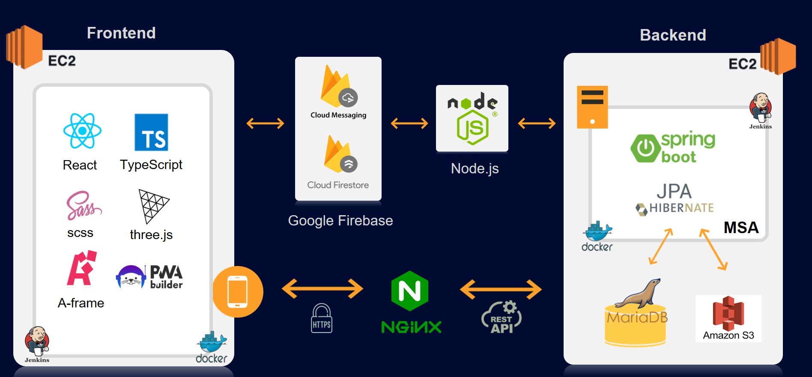
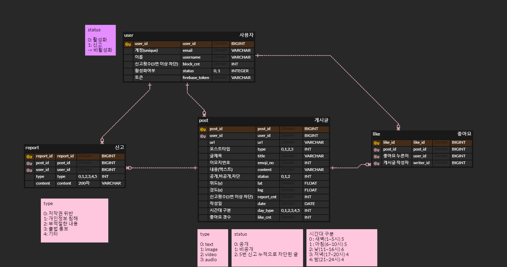

# 자율 프로젝트 - 동하책 (同下冊)
---
#### 📑 목차

- [1. 소개](#1-소개)
- [2. 주요 기능](#2-주요-기능)
- [3. 시스템 구조도 및 핵심 기술](#3-시스템-구조도-및-핵심-기술)
- [4. 기술스택](#4-기술스택)
- [5. ERD 다이어그램](#5-erd-다이어그램)
- [6. 기능 상세](#6-기능-상세)
- [7. 개발자](#7-개발자)
- [8. 참고 자료](#8-참고-자료)

---
 

## 1.소개
**동하책** 은 일상에서 가볍게 사용할 수 있는 위치 기반 익명 커뮤니티입니다. 사용자가 현재 위치에서 하고 싶은 말을 풍선에 담아 띄우면, 같은 지역의 다른 사용자들이 풍선을 확인할 수 있습니다.  
풍선은 저희 서비스의 핵심 컨텐츠로, 글, 이미지, 영상, 음성 메시지 중 하나를 선택하여 내용을 작성할 수 있습니다. 사용자는 원하는 이모지로 풍선 모양을 지정하고, 공개 여부를 설정할 수 있습니다. 
사용자는 공간에 떠다니는 풍선을 선택하여 같은 지역에서 작성된 풍선의 내용을 확인하거나, 좋아요를 눌러 공감을 표시할 수 있습니다. 풍선에 좋아요가 눌리면 작성자에게 알림이 제공됩니다.  
추억을 오랫동안 간직할 수 있도록 풍선을 기기에 저장하는 기능도 지원합니다. 또한, 자신이 작성한 풍선이나 좋아요 알림을 모아볼 수 있습니다.  
이를 통해 저희 동심 팀은 **다양한 사람들이 각자의 이야기를 자유롭게 나눌 수 있는 플랫폼**을 제공하고자 합니다.

---

 

## 2. 주요 기능
> _동하책에서 제공하는 주요 기능입니다. 자세한 내용은 [6. 기능상세](#6-기능-상세) 에서 확인하실 수 있습니다._

#### 1) 익명으로 풍선(게시글) 작성하기
- 사용자는 원하는 모양과 종류(텍스트, 음성, 이미지, 영상)로 메시지를 등록할 수 있습니다. 
- 메시지는 '풍선'이라는 형태로 저장됩니다.
- 메시지의 공개/비공개 여부를 선택할 수 있습니다. 
- 모든 종류의 메시지는 필터링 되어 저장됩니다.

#### 2) 내가 작성한 풍선 확인하기
- 사용자는 내가 작성한 풍선을 확인할 수 있습니다. 
- 익명으로 보여지는 게시글과 달리, 자신의 공간에서 등록한 메시지를 리스트 형태로 확인 가능합니다. 

#### 3) 풍선 조회
- 현재 위치를 기반으로 주변에 존재하는 풍선을 조회할 수 있습니다.
- 자신이 탐색하고 싶은 지역에 어떤 풍선이 있는지도 조회가능합니다.
- VR 형태로 풍선을 확인할 수 있습니다. 기기를 움직이면 주변에 존재하는 다양한 풍선을 조회할 수 있습니다.

#### 4) 실시간 알림
- 실시간 알림 관리를 위해 SDK(Software Development Kit)기반 firebase를 이용하였습니다.
- 실시간 알림 요청을 위해 FCM(Firebase Cloud Messaging)을 사용합니다. 

---
 

## 3. 시스템 구조도 및 핵심 기술
#### 1) 아키텍처

 

#### 2) 프론트엔드 
- 로딩 속도 개선을 위해 렌더링이 오래 걸리는 메인페이지를 미리 로드하여 다른 페이지 이동 시 숨김처리 하였습니다.

#### 3) 백엔드
- 이미지 필터링, 컨텐츠의 용량으로 인한 처리 속도 지연 등으로 인해 부하가 집중되는 기능을 위주로 서버를 분리하였습니다.
- 이미지, 영상, 음성의 경우 S3와 연동되며, 텍스트는 MariaDB에 필터링되어 저장됩니다.
- 부하테스트를 통해 약 1400명의 사용자가 동시 접속 가능하다는 것을 확인하였습니다.

---
 

## 4. 기술스택

|      Part      |                            Tech ⚙                            |
| :------------: | :----------------------------------------------------------: |
|   **Front**    |  |
|    **Back**    |  |
| **Deployment** |  |

> _토글을 클릭하시면 자세한 사항을 확인하실 수 있습니다. Build 방법은 [포팅매뉴얼](exec/[베지밀] 포팅매뉴얼.pdf)을 참고해주세요._

<strong> 사용 IDE 및 OS 
</strong>

- OS: Ubuntu 20.04.5 LTS  
- IntelliJ IDEA 2022.1.3
- Visual Studio Code : 1.70.2v
- UI/UX: Figma

<strong> 백엔드 기술스택 
</strong>

- Openjdk : 11
- Springboot :  2.7.5
- Spring: gradle 
- MariaDB : mariadb 10.3.34
- AWS : ubuntu 20.04.4 LTS 
- Jenkins : 2.361.2
- Docker : 20.10.18
- Nginx :  nginx/1.18.0 (Ubuntu)

<strong> 프론트엔드 기술스택 
</strong>
	
- Node.js 16.18.0 LTS
- React 18.2.0
- TypeScript 4.8.4

---
 

## 5. ERD 다이어그램

---
 

## 6. 기능 상세
> _주요 기능만을 설명합니다. 자세한 시나리오가 궁금하시다면 [UCC]()나 [동하책 발표자료]()를 참고해주세요!_

#### 1) 메인 페이지
* 사용자 경험 증대를 위해 나만의 방이라는 컨셉으로 three.js 를 통해 메인페이지를 구성하였습니다. 

#### 2) 풍선 (게시글)
##### ＊ 풍선 작성하기
> 다양한 풍선 이미지와 유형, 공개여부를 설정하여 게시글을 작성할 수 있습니다.  
> 시간대에 따라 배경의 색이 다르게 저장됩니다.

---

##### ＊ 풍선 조회하기 (세계지도)
> 2D 형태로 전국에 존재하는 풍선을 조회할 수 있습니다. 

---

##### ＊풍선 조회하기 (VR)
> 자신의 현재 위치를 기준으로 주위에 작성된 게시글을 조회할 수 있습니다.  
> 사용자 경험을 위해 VR 형태로 제공되며 기기를 움직여 다양한 풍선을 확인할 수 있습니다.  
> 다 읽은 풍선은 연하게 처리되어 사용자가 쉽게 읽은 메시지를 구분할 수 있도록 하였습니다. 

#### 3) 실시간 알림
> 사용자는 실시간으로 자신의 글에 좋아요가 클릭되었다는 것을 확인할 수 있습니다.  
> 익명으로 게시글은 관리되기 때문에 좋아요를 누른 사람과 글을 작성한 사람은 공개되지 않습니다.

---
 

## 7. 개발자
#### 1) 프론트엔드
* [조예지](https://github.com/celpegor216): 팀장 / 지도 / VR / UI/UX
* [나원경](https://github.com/hitriee): 실시간 알림 / 배경음악 / 게시글 작성 / UI/UX
* [이성조](https://norwegian-forest-cat.tistory.com/): Three.js를 이용하여 나만의 방 꾸미기 / 게시글 리스트 /UI/UX

---
 

#### 2) 백엔드
* [김영서](https://github.com/dudtjakdl): 필터링 / API / 부하테스트
* [정지원](https://github.com/stopone2639): AWS S3 / API / 이미지, 영상 압축 
* [정호진](https://github.com/junghojin): MSA 기반 설계 및 개발 / API / 문서화

 

---

## 8. 참고 자료
* [Git/Jira Convention](assets/동하책_Git_Jira_Convention.pdf)
* [WBS](assets/동하책_WBS.pdf)
* [기능명세서](assets/동하책_기능명세서.md)
* [와이어프레임](assets/동하책_와이어프레임.pdf)
* [사용자흐름도](assets/동하책_사용자흐름도.pdf)
* [포팅매뉴얼](exec/자율_프로젝트_동하책_포팅매뉴얼.pdf)
* [시연시나리오](exec/동하책_시연_시나리오.pdf)
* [UCC](assets/동하책_UCC.mp4)
* [최종발표 PPT](assets/동하책_최종발표_PPT.pptx)

